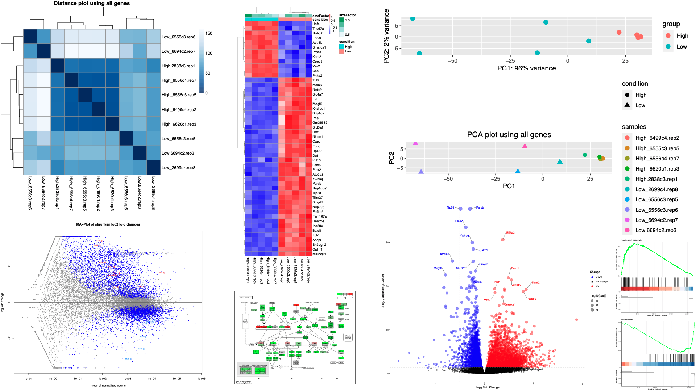

# easyRNAseqDE
An R package for RNAseq differential expression analysis and visualization, in an easy and reproducible way.

This package is for the downstream analysis after running [PipeRNAseq](https://github.com/sunyumail93/PipeRNAseq). Please download PipeRNAseq output files to the local computer and perform these analysis.

## Software prerequisites

This R package is designed to analyze RNAseq raw counts (produced by featureCounts from Subread) or TPM values from Salmon software.

The following packages in R (>= 3.5.0) are required

```
DESeq2
tximport
RColorBrewer
pheatmap
ggplot2
gplots
cluster
ggrepel
readr
reshape2
clusterProfiler
DOSE
pathview
```

If you would like to perform GO, KEGG and GSEA analysis, the database related to the data species is also required, for example, org.Mm.eg.db for mouse, and org.Hs.eg.db for human. 

## Installation

```
library(devtools)
install_github("sunyumail93/easyRNAseqDE")

library(easyRNAseqDE)
```

## Quick start

The easyRNAseqDE contains four six functions:

- Two functions merge raw data from [PipeRNAseq](https://github.com/sunyumail93/PipeRNAseq) salmon or featureCounts output to a result table: **MergeFeatureCounts** and **MergeSalmon**.

- Two functions perform the full DE analysis using salmon or featureCounts results: **easyDE_FromRawCounts** and **easyDE_FromSalmon**.

- Two functions perform GO, GSEA and KEGG analysis: **easyEnrich_GO_GSEA** and **easyEnrich_KEGG**.

Here is an example using the salmon test data to perform DE analysis within a minute:

```
library(easyRNAseqDE)

# Set working directory
setwd("/home/sunyumail93/Demo")

# Copy the raw data to the working directory
SalmonDataPath <- system.file("extdata", "data_DE_FromSalmon/", package="easyRNAseqDE")
SalmonFilesPath <- list.files(path = SalmonDataPath, pattern = ".sf")
file.copy(from=paste0(SalmonDataPath,SalmonFilesPath), to=CurrPath, 
            overwrite = TRUE, recursive = FALSE, 
            copy.mode = TRUE)

# Retrieve data and file paths
SampleInfo_path <- system.file("extdata", "data_DE_FromSalmon/SalmonData.txt", package="easyRNAseqDE")
ComparisonFile_path <- system.file("extdata", "data_DE_FromSalmon/Comparisons.txt", package="easyRNAseqDE")
uniqueMatchingFile_path <- system.file("extdata", "data_DE_FromSalmon/mm10.uniqMatching.txt", package="easyRNAseqDE")

# DE analysis
easyDE_FromSalmon(SampleInfo = SampleInfo_path,
                  uniqueMatchingFile = uniqueMatchingFile_path,
                  ComparisonFile = ComparisonFile_path, 
                  createQuickomicsFiles=T, QuickomicsPrefix="Immunity2018")
                  
# GO and GSEA analysis
easyEnrich_GO_GSEA(ComparisonFile = ComparisonFile_path, 
                  OrganDatabase = "org.Mm.eg.db", 
                  GOpajd_cutoff = 0.01, 
                  GOlog2FC_cutoff = 2.5)

# KEGG analysis
KEGGPathway_file <- system.file("extdata", "data_DE_FromSalmon/PathwayID.txt", package="easyRNAseqDE")
easyEnrich_KEGG(ComparisonFile = ComparisonFile_path, 
                  OrganDatabase = "org.Mm.eg.db",
                  KEGGSpeciesName = "mmu",
                  KEGGPathwayFile = KEGGPathway_file)
```

Then we can upload the four csv files and visualize the results in [Quickomics](http://quickomics.bxgenomics.com/?unlisted=PRJ_Immunity2018_Cs9rRo).

This pipeline also generates the following plots:



Here is another example using the featureCounts test data to perform DE analysis within a minute:

```
library(easyRNAseqDE)

# Set working directory
setwd("/home/sunyumail93/Demo")

# Retrieve data and file paths
data(featureCounts_count_matrix)
SampleInfo_path <- system.file("extdata", "data_DE_FromRawCounts/SampleInfo.txt", package="easyRNAseqDE")
ComparisonFile_path <- system.file("extdata", "data_DE_FromRawCounts/Comparisons.txt", package="easyRNAseqDE")

# DE analysis
easyDE_FromRawCounts(count_matrix = featureCounts_count_matrix, 
                     LabelFile = SampleInfo_path, 
                     ComparisonFile = ComparisonFile_path, 
                     createQuickomicsFiles=T, 
                     QuickomicsPrefix="Immunity2018_featureCounts")
                     
# GO and GSEA analysis
easyEnrich_GO_GSEA(ComparisonFile = ComparisonFile_path, 
                  OrganDatabase = "org.Mm.eg.db", 
                  GOpajd_cutoff = 0.01, 
                  GOlog2FC_cutoff = 2.5)

# KEGG analysis
KEGGPathway_file <- system.file("extdata", "data_DE_FromRawCounts/PathwayID.txt", package="easyRNAseqDE")
easyEnrich_KEGG(ComparisonFile = ComparisonFile_path, 
                  OrganDatabase = "org.Mm.eg.db",
                  KEGGSpeciesName = "mmu",
                  KEGGPathwayFile = KEGGPathway_file)
```

## Full tutorial

## 1, Merge featureCounts results into a table/matrix

This function is compatible with the featureCounts output files from PipeRNAseq, with *.featureCounts.gene.txt suffix.

```
# Prepare the featureCounts output files after running PipeRNAseq
Control.rep1.featureCounts.gene.txt
Control.rep2.featureCounts.gene.txt
Treated.rep1.featureCounts.gene.txt
Treated.rep2.featureCounts.gene.txt

# Prepare the sample information file, with contains 3 columns: SampleFile, ShortName, Condition
# The SampleFile should be exactly same as the file names above
# The ShortName indicates the name in the final merged table, to make the names simplified
# The Condition column is for future DE analysis, but won't be used in this function

$ cat SampleInfo.txt
Control.rep1.featureCounts.gene.txt Control.rep1 Control
Control.rep2.featureCounts.gene.txt Control.rep2 Control
Treated.rep1.featureCounts.gene.txt Treated.rep1 Treated
Treated.rep2.featureCounts.gene.txt Treated.rep2 Treated

# Then we can run the following function:
# Please use setwd() to navigate to the working directory containing featureCounts output and SampleInfoFile.txt
MergeFeatureCounts(SampleInfoFile, OutputPrefix="default", write_to_file=F)

# Example 1: return a merged table as data.frame
MergedCounts <- MergeFeatureCounts(SampleInfoFile = "SampleInfo.txt")

# Example 2, return a merged table as data.frame, and write to a file
MergedCounts <- MergeFeatureCounts(SampleInfoFile = "SampleInfo.txt", 
                   OutputPrefix = "Merged.featureCounts.txt",
                   write_to_file = F)
```

This MergedCounts table can be directly used in the DE analysis, as the input data for **easyDE_FromRawCounts**.

## 2, Merge salmon results into a table/matrix

This function is compatible with the salmon output files from PipeRNAseq, with *.salmon.sf suffix.

```
# Prepare the featureCounts output files after running PipeRNAseq
Control.rep1.quant.sf
Control.rep2.quant.sf
Treated.rep1.quant.sf
Treated.rep2.quant.sf

# Copy the uniqueMatchingFile file from PipeRNAseq pipeline
mm10.uniqueMatching.txt  #For mouse
hg38.uniqueMatching.txt  #For human

# Prepare the sample information file, with contains 3 columns: SampleFile, ShortName, Condition
# The SampleFile should be exactly same as the file names above
# The ShortName indicates the name in the final merged table, to make the names simplified
# The Condition column is for future DE analysis, but won't be used in this function

$ cat SampleInfo.txt
Control.rep1.quant.sf Control.rep1 Control
Control.rep2.quant.sf Control.rep2 Control
Treated.rep1.quant.sf Treated.rep1 Treated
Treated.rep2.quant.sf Treated.rep2 Treated

# Then we can run the following function:
# Please use setwd() to navigate to the working directory containing featureCounts output and SampleInfoFile.txt
MergeSalmon(SampleInfoFile, uniqueMatchingFile, OutputPrefix="default", write_to_file=F)

# Example 1: return a merged Counts and TPM table as data.frame
MergedCountsTPM <- MergeSalmon(SampleInfoFile = "SampleInfo.txt", 
                   uniqueMatchingFile = "mm10.uniqueMatching.txt")

# Example 2, return a merged Counts and TPM table as data.frame, and write to a file
MergedCountsTPM <- MergeSalmon(SampleInfoFile = "SampleInfo.txt", 
                   uniqueMatchingFile = "mm10.uniqueMatching.txt",
                   OutputPrefix = "Merged.salmon.CountsAndTPM.txt",
                   write_to_file = T)
```

This merged salmon table can be used to examine the TPM values, but won't be compatible with the DE analysis. To perform DE analysis using salmon outputs, please refer section 4 and use **easyDE_FromSalmon** function.

## 3, Run differential expression (DE) analysis from merged featureCounts table

We can use any merged raw counts table (either from **MergeFeatureCounts**, or read from an external file) and perform DE analysis using one of the main function in this package: **easyDE_FromRawCounts**.

```
# Prepare the sample information/Label file, with contains 3 columns: SampleFile, ShortName, Condition
# The SampleFile should be exactly same as the file names above
# The ShortName indicates the name in the final merged table, to make the names simplified
# The Condition column is for future DE analysis, but won't be used in this function

$ cat SampleInfo.txt
PS.rep1.featureCounts.gene.txt PS.rep1 PS
PS.rep2.featureCounts.gene.txt PS.rep2 PS
RS.rep1.featureCounts.gene.txt RS.rep1 RS
RS.rep2.featureCounts.gene.txt RS.rep2 RS
ART.rep1.featureCounts.gene.txt ART.rep1 ART
ART.rep2.featureCounts.gene.txt ART.rep2 ART

# Prepare the comparison file, with 3 columns: Condition1, Condition2, ComparisonName/Output Prefix
# The direction of the comparison: Condition2_vs_Condition1:

$ cat Comparisons.txt
PS RS Output.Human.RSvsPS
PS ART Output.Human.ARTvsPS

# Prepare the raw counts using MergeFeatureCounts function mentioned above
MergedCounts <- MergeFeatureCounts(SampleInfoFile = "SampleInfo.txt")

# Turn on the createQuickomicsFiles=T and provide a output prefix for Quickomics file generation

# Run the full DE analysis
easyDE_FromRawCounts(count_matrix = MergedCounts, 
                     LabelFile = "SampleInfo.txt", 
                     ComparisonFile = "Comparisons.txt", 
                     createQuickomicsFiles=T, 
                     QuickomicsPrefix="Two_DE_Analysis")
```

For each comparison, the following files will be generated. Here, the Prefix = "Output.Human.RSvsPS" or "Output.Human.ARTvsPS":

```
Prefix.DESeq2.txt
Prefix.DistancePlot.pdf
Prefix.HeatmapTop50.pdf
Prefix.MAPlot.Labeltop20.pdf
Prefix.PCA.1.pdf
Prefix.PCA.2.pdf
Prefix.VolcanoPlot.pdf
```

[Quickomics](https://github.com/interactivereport/Quickomics) files for the whole project:

```
Two_DE_Analysis_Comparison_data.csv
Two_DE_Analysis_Exp_Log2Data.csv             #Choose one from Log2Data and RawData to upload to Quickomics
Two_DE_Analysis_Exp_RawData.csv
Two_DE_Analysis_ProteinGeneName_optional.csv
Two_DE_Analysis_Sample_metadata.csv
```

## 4, Run differential expression (DE) analysis from salmon output

This function is compatible with the salmon output files from PipeRNAseq, with *.salmon.sf suffix. Different from **MergeSalmon** function, **easyDE_FromSalmon** runs the full DE analysis.

```
# Prepare the featureCounts output files after running PipeRNAseq
Control.rep1.quant.sf
Control.rep2.quant.sf
Treated.rep1.quant.sf
Treated.rep2.quant.sf

# Copy the uniqueMatchingFile file from PipeRNAseq pipeline
mm10.uniqueMatching.txt  #For mouse
hg38.uniqueMatching.txt  #For human

# Prepare the sample information file, with contains 3 columns: SampleFile, ShortName, Condition
# The SampleFile should be exactly same as the file names above
# The ShortName indicates the name in the final merged table, to make the names simplified
# The Condition column is for future DE analysis, but won't be used in this function

$ cat SampleInfoFile.txt
Control.rep1.quant.sf Control.rep1 Control
Control.rep2.quant.sf Control.rep2 Control
Treated.rep1.quant.sf Treated.rep1 Treated
Treated.rep2.quant.sf Treated.rep2 Treated

# Prepare the comparison file, with 3 columns: Condition1, Condition2, ComparisonName/Output Prefix
# The direction of the comparison: Condition2_vs_Condition1:
# You can include multiple lines of comparisons here. For each comparison, no need to cover all data.
# The pipeline will subset data included in the comparison and run the analysis with those data only.

$ cat Comparisons.txt
Control Treated Output.Control_vs_Treated

# Then we can run the following function:
# Please use setwd() to navigate to the working directory containing featureCounts output and SampleInfoFile.txt

# Example 1: return a merged Counts and TPM table as data.frame
easyDE_FromSalmon(SampleInfo = "SampleInfoFile.txt",
                  uniqueMatchingFile = "mm10.uniqueMatching.txt",
                  ComparisonFile = "Comparisons.txt", 
                  createQuickomicsFiles=T, QuickomicsPrefix="DEAnalysis")
```

For each comparison, the following files will be generated. Here, the Prefix = "Output.Control_vs_Treated":

```
Prefix.salmon.All.DEseq2GeneCountsTPMrlogNormcounts.txt
Prefix.salmon.Plot.DistancePlot.All.pdf
Prefix.salmon.Plot.HeatmapTop50.pdf
Prefix.salmon.Plot.MA.pdf
Prefix.salmon.Plot.PCA.1.pdf
Prefix.salmon.Plot.PCA.2.pdf
Prefix.salmon.Plot.VolcanoPlot.pdf
```

[Quickomics](https://github.com/interactivereport/Quickomics) files for the whole project:

```
DEAnalysis_Comparison_data.csv
DEAnalysis_Exp_Log2TPMData.csv             #Choose one from Log2Data and RawData to upload to Quickomics
                                           #log2(TPM+1) is good for plotting heatmap/PCA plots, without any other adjustments.
DEAnalysis_Exp_RawTPMData.csv              #Raw TPM is suggested if you woule like to plot the expression values.
DEAnalysis_Exp_rlogData.csv                #rlog is better at plotting heatmap/PCA plots, and it is adjusted for variance stablization
DEAnalysis_ProteinGeneName_optional.csv
DEAnalysis_Sample_metadata.csv
```

## 5, Run GO and GSEA analysis based on the DE results

Please make sure DE analysis has been run before running this **easyEnrich_GO_GSEA** function. This function takes the comparison file as input, and look for DE analysis output files: ComparisonName.salmon.All.DEseq2GeneCountsTPMrlogNormcounts.txt for salmon, and ComparisonName.RawCounts.All.DEseq2GeneCountsNormcounts.txt for featureCounts results. If you have your own DESeq2 results, you can directly use it by renaming to the above two types of names. It recognizes the first a few columns of the DESeq2 results.

Please choose the correct species GO annotation package and install it, for example, org.Mm.eg.db for mouse, and org.Hs.eg.db for human. If less than 10 genes in the comparison, it will skip, otherwise, use `forcerun = T` to force the pipeline to run it.

```
# See full manual page:
??easyEnrich_GO_GSEA

easyEnrich_GO_GSEA(ComparisonFile = "Comparisons.txt", 
                  OrganDatabase = "org.Mm.eg.db",
                  GOpajd_cutoff = 0.05, 
                  GOlog2FC_cutoff = 1.5,
                  ShowTermNum = 20,
                  forcerun = F)
```

## 6, Run KEGG analysis based on the DE results

Please make sure DE analysis has been run before running this **easyEnrich_KEGG** function. Similar to **easyEnrich_GO_GSEA**, it also looks for DE output files and run KEGG enrichment analysis. The user can also provide a list of KEGG pathways and pass to `KEGGPathwayFile` to plot. This `KEGGPathwayFile` is a two-column, tab-delimited text file with: KEGG_id KEGG_full_name. If less than 10 genes in the comparison, it will skip, otherwise, use `forcerun = T` to force the pipeline to run it.

```
# See full manual page:
??easyEnrich_KEGG

easyEnrich_KEGG(
  ComparisonFile = "Comparisons.txt",
  OrganDatabase = "org.Mm.eg.db",
  KEGGSpeciesName = "mmu",
  KEGGPathwayFile = "PathwayID.txt",
  GOpajd_cutoff = 0.05,
  GOlog2FC_cutoff = 1.5,
  forcerun = F
)
```
